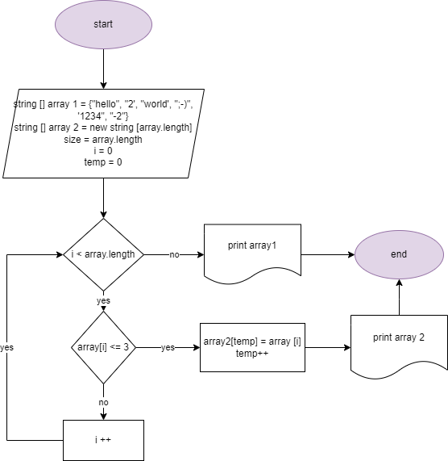

# Реализация проекта "Итоговая проверочная работа"
## Цель проекта
Написать программу, которая из имеющегося массива строк формирует массив строк, длина которых меньше или равна 3 символам.
## Задачи, которые были решены:
1. Составлена блок-схема алгоритма .
2. Написана программа с использованием языка C#.
В программе создан основной метод типа void, позволяющий сформировать массив строк, длина которых меньше или равна 3 символам <CreatNewArrayThreeChar> и методы вывода массивов на печать <PrintArray>.

